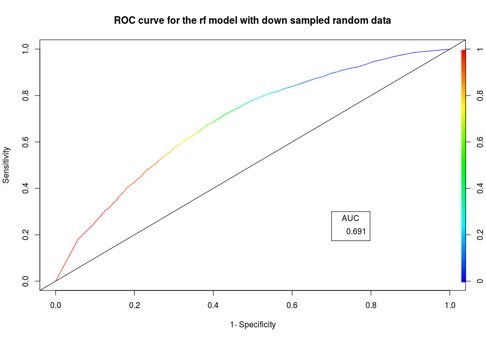

Click-Through Rate Prediction
================
Varun Khanna
6 November 2018

I found a dataset of [Click-Through Rate](https://www.kaggle.com/c/avazu-ctr-prediction) (CTR) on Kaggle. This dataset is around 6GB and have 11 days worth of Avazu data (mobile ads) with around 44 million records. The aim of the project is to predict whether a mobile ad will be clicked or not.

We will fit number of classification models to the randomly selected dataset of 100,000 records and 19 variables. The dataset consist of 19 predictor variables *i.e* location of the ad, device type, device connection type etc. The dataset will be randomly sampled into 80% training and 20% testing data. A comparision between different models on misclassification rate and area under the curve will be made.

The following packages are used for loading data, visualization and model building.

``` r
library("tidyverse") # metapackage contains useful functions
library("corrplot")
library("RColorBrewer")
library("caret")
library("ROCR")
```

``` r
#Load the data
train <- read_csv("original_data/random")
# display the data
train %>% head() 
```

    ## # A tibble: 6 x 24
    ##         id click   hour    C1 banner_pos site_id site_domain site_category
    ##      <dbl> <int>  <int> <int>      <int> <chr>   <chr>       <chr>        
    ## 1  7.01e¹⁸     0 1.41e⁷  1005          1 85f751… c4e18dd6    50e219e0     
    ## 2  1.53e¹⁹     0 1.41e⁷  1005          0 1fbe01… f3845767    28905ebd     
    ## 3  3.56e¹⁷     0 1.41e⁷  1005          0 6399ed… 968765cd    f028772b     
    ## 4  4.79e¹⁸     0 1.41e⁷  1005          1 a78530… 7e091613    f028772b     
    ## 5  3.96e¹⁸     0 1.41e⁷  1005          0 6256f5… 28f93029    f028772b     
    ## 6  8.23e¹⁷     0 1.41e⁷  1005          1 d9750e… 98572c79    f028772b     
    ## # ... with 16 more variables: app_id <chr>, app_domain <chr>,
    ## #   app_category <chr>, device_id <chr>, device_ip <chr>,
    ## #   device_model <chr>, device_type <int>, device_conn_type <int>,
    ## #   C14 <int>, C15 <int>, C16 <int>, C17 <int>, C18 <int>, C19 <int>,
    ## #   C20 <int>, C21 <int>

``` r
# look at the variable 
names(train)
```

    ##  [1] "id"               "click"            "hour"            
    ##  [4] "C1"               "banner_pos"       "site_id"         
    ##  [7] "site_domain"      "site_category"    "app_id"          
    ## [10] "app_domain"       "app_category"     "device_id"       
    ## [13] "device_ip"        "device_model"     "device_type"     
    ## [16] "device_conn_type" "C14"              "C15"             
    ## [19] "C16"              "C17"              "C18"             
    ## [22] "C19"              "C20"              "C21"

From dataset documentation at Kaggle we know that *click* is the target variable where click = 0 means the ad was not clicked and click = 1 means the ad was clicked. The first thing we would like to know is the percentage of clicked vs not clicked ads. However, before that let us first drop id columns which have no predictive significance.

Exploratory data analysis
-------------------------

``` r
# remove id columns
train <- train  %>% select(-id, -site_id, -app_id, -device_id, -device_ip)
# find how many adds were clicked
sum(train$click)
## [1] 16960
# find the proportion of ads clicked
prop.table(table(train$click))
## 
##      0      1 
## 0.8304 0.1696
#  it also possible to take a mean of click column
mean(train$click)
## [1] 0.1696
```

We can see that around 17% of the ads were clicked, this can serve as our baseline.

Let us look at variables
------------------------

It make sense that *device type* (phone, desktop etc.) will impact the users clicking on the addvertisment. Let us explore the *device type* column a bit more.

``` r
# Count clicks by device_type
device_type_count <- train %>% group_by(device_type, click) %>% summarise(click_count = n())
device_type_count$device_type <- as.character(device_type_count$device_type)
# Plot the clicks by count 
ggplot(device_type_count, aes( x = device_type, y = click_count, fill = as.factor(click))) + geom_bar(stat = "identity", position = position_dodge())
```


We can see that there are 4 type of devices in the dataset, with 1 being the most prevelant. Let us further explore the click ratio per device.

### Plot by log of the total clicks by device\_type

``` r
device_type_count  <- train %>% group_by(device_type) %>% summarise(total_clicks = n())
ggplot(device_type_count, aes( x = device_type, y = log(total_clicks))) + geom_bar(stat = "identity") + labs(x = "Device Type", y = "Log total clicks")
```


``` r
device_type_count$device_type <- as.character(device_type_count$device_type)
# Plot proportional clicks by device type
device_type_df <- as.data.frame(prop.table(table(train$device_type,train$click),1))
ggplot(device_type_df, mapping = aes(x = Var1, y = Freq, fill = Var2)) + geom_bar(stat = "identity") + scale_y_continuous(labels = scales::percent) + labs(x = "Device type", y = "Proportional click %") + scale_fill_manual(values = c("#F15854","#5DA5DA"), name = "click")
```


Plot by banner location
-----------------------

Another interesting variable is *banner location* (position of the advertisment).

``` r
# Count clicks by ad location
banner_pos_count <- train %>% group_by(banner_pos, click) %>% summarise(click_count = n())
banner_pos_count$banner_pos <- as.character(banner_pos_count$banner_pos)
# Plot the clicks by count 
ggplot(banner_pos_count, aes( x = banner_pos, y = click_count, fill = as.factor(click))) + geom_bar(stat = "identity", position = position_dodge())
```


``` r
# Proportional click rate
banner_df <- data.frame(prop.table(table(train$banner_pos, train$click),1)) # 1 - row percentages

ggplot(banner_df, mapping = aes(x = Var1, y = Freq, fill = Var2)) + geom_bar(stat = "identity") + scale_y_continuous(labels = scales::percent) + labs(x = "Ad location", y = "Proportional click %") + scale_fill_manual(values = c("#F15854","#5DA5DA"), name = "click")
```


Plot by device connection type
------------------------------

``` r
# Count clicks by device_conn_type
device_conn_type_count <- train %>% group_by(device_conn_type, click) %>% summarise(click_count = n())
device_conn_type_count$device_conn_type <- as.character(device_conn_type_count$device_conn_type)
# Plot the clicks by count 
ggplot(device_conn_type_count, aes( x = device_conn_type, y = click_count, fill = as.factor(click))) + geom_bar(stat = "identity", position = position_dodge())
```


``` r
# Proportional click rate
device_conn_type_df <- data.frame(prop.table(table(train$device_conn_type, train$click),1))

ggplot(device_conn_type_df, mapping = aes(x = Var1, y = Freq, fill = Var2)) + geom_bar(stat = "identity") + scale_y_continuous(labels = scales::percent) + labs(x = "Device connection type", y = "Proportional click %") + scale_fill_manual(values = c("#F15854","#5DA5DA"), name = "click")
```


**Note:** *Device connection type* does not seems to be very powerful feature. Therefore, I will remove before building the model.

What about other variables like C15,C16 and C18
-----------------------------------------------

``` r
# Plot C15
click_15_count <- train %>% group_by(C15, click) %>% summarise(click_count = n())
click_15_count$C15 <- as.character(click_15_count$C15)
# Plot the clicks by count 
ggplot(click_15_count, aes( x = C15, y = click_count, fill = as.factor(click))) + geom_bar(stat = "identity", position = position_dodge())
```


``` r
# Plot proportional clicks
click_C15_df <- data.frame(prop.table(table(train$C15,train$click),1))
ggplot(click_C15_df, mapping = aes(x = Var1, y = Freq, fill = Var2)) + geom_bar(stat = "identity") + scale_y_continuous(labels = scales::percent) + labs(x = "C15", y = "Proportional click %", title = "C15") + scale_fill_manual(values = c("#F15854","#5DA5DA"), name = "click")
```


``` r
# Plot C16
click_16_count <- train %>% group_by(C16, click) %>% summarise(click_count = n())
click_16_count$C16 <- as.character(click_16_count$C16)
# Plot the clicks by count 
ggplot(click_16_count, aes( x = C16, y = click_count, fill = as.factor(click))) + geom_bar(stat = "identity", position = position_dodge())
```


``` r
# Plot proportional clicks
click_C16_df <- data.frame(prop.table(table(train$C16,train$click),1))
ggplot(click_C16_df, mapping = aes(x = Var1, y = Freq, fill = Var2)) + geom_bar(stat = "identity") + scale_y_continuous(labels = scales::percent) + labs(x = "C16", y = "Proportional click %", title = "C16") + scale_fill_manual(values = c("#F15854","#5DA5DA"), name = "click")
```


``` r
# Plot C18
click_18_count <- train %>% group_by(C18, click) %>% summarise(click_count = n())
click_18_count$C18 <- as.character(click_18_count$C18)
# Plot the clicks by count 
ggplot(click_18_count, aes( x = C18, y = click_count, fill = as.factor(click))) + geom_bar(stat = "identity", position = position_dodge())
```


``` r
# Plot proportional clicks
click_C18_df <- data.frame(prop.table(table(train$C18,train$click),1))
ggplot(click_C18_df, mapping = aes(x = Var1, y = Freq, fill = Var2)) + geom_bar(stat = "identity") + scale_y_continuous(labels = scales::percent) + labs(x = "C18", y = "Proportional click %", title = "C18") + scale_fill_manual(values = c("#F15854","#5DA5DA"), name = "click")
```


Remove highly correlated variables
----------------------------------

Correlation is a statistial technique through which we can understand how different variables are related to each other. It gives us an indication of how strong or weak relation is between variables. For example, study time of students and exam scores; as study time of student increases, so does his exam scores. Ideally, we want to have independent features in our dataset therefore we remove correlated variables from our dataset.

R allows us to calcualte correlation coffecient easily. Pearson correlation is the most common type of correlation which is used to measure the linear relationship between two variables. It is the default coffecient calculated with the `cor()` function in R and returns correlation between pair of all numeric attributes in range -1 to +1. We can obtain the correlation among all the numeiric variables in a single line of code and plot them as a heatmap (see the code below).

``` r
# Select numeric columns and calcaulate the correlation
cor_matrix <- cor(select_if(train, is.numeric))
# Plot the correlation between the variables
corrplot::corrplot(cor_matrix, method = "number", type = "upper")
```


``` r
trainingSet <- select(train, c(-C1,-C17))
# select only numeric columns
trainingSet <- select_if(trainingSet, is_numeric)
# remove hour column
trainingSet <- select(trainingSet, -hour)
# remove device_conn_type column
trainingSet <- select(trainingSet, -device_conn_type)
# Remove uncommon rows
trainingSet <- trainingSet[trainingSet$C15 %in% c(216,300,320),]
trainingSet <- trainingSet[trainingSet$C16 %in% c(36,50,250),]
trainingSet <- trainingSet[trainingSet$C18 %in% c(0,1,2,3),]
trainingSet <- trainingSet[trainingSet$device_type %in% c(0,1,4),]
trainingSet <- trainingSet[trainingSet$banner_pos %in% c(0,1),]
trainingSet$click <- as.factor(trainingSet$click)
```

**Note:** *C17* and *C14* and *C1* and *device\_type* are highly correlated variables. I removed *C17* and *C1* variables from further analysis.

Predictive modeling
-------------------

There are two main type of machine learning models: regression and classification based on the taget variable. In this case since the target variable is categorical(0/1) we will use classification model.

First I am going to use random forest (RF). RF is an ensemble classifier made of many individual decision tree models. It combines the result from different models. The major advantgaes of RF classifer are given below:

1.  Can handle large datasets with high dimensionality.
2.  It can handle missing values and maintain accuracy for the missing data.
3.  Helps in ranking features based on importance for classifiation.

However, disadvantages include:

1.  May feel like a black box apporach as modeller does not have much control on what the model does.
2.  Is not very good for regression problems.

RF model is used in various industries such as banking sector to find loyal customers, in healthcare sector to identify diseases by studying the patient health records, in the stock market to identify the stock behaviour and the expected profit or loss due to purchase of particular stock and in e-commerce industry to identify the likelihood of the customer liking the product.

``` r
set.seed(100)
trainIndex <- createDataPartition(trainingSet$click, p = 0.8, list = F, times  = 1 )

train <- trainingSet[trainIndex,]
test <- trainingSet[-trainIndex,]
# for parallel processing
library("doSNOW")
cl <- makeCluster(8,type = "SOCK")
registerDoSNOW(cl)

ctrl <- trainControl(method = "repeatedcv", number = 5, savePredictions = TRUE, repeats = 5)

tunegrid <- expand.grid(.mtry = c(seq(1,9, by = 1)))
# train the model
model_rf <- train(click ~ ., data = train,method = "rf", trControl = ctrl, tuneGrid = tunegrid, metric = "Accuracy")

stopCluster(cl)

# Predict on test data and generate the confusion matrix
cm <- confusionMatrix(predict(model_rf, newdata = test), test$click, positive = "1")
cm
```

    ## Confusion Matrix and Statistics
    ## 
    ##           Reference
    ## Prediction     0     1
    ##          0 16328  3215
    ##          1   142   158
    ##                                          
    ##                Accuracy : 0.8308         
    ##                  95% CI : (0.8255, 0.836)
    ##     No Information Rate : 0.83           
    ##     P-Value [Acc > NIR] : 0.3855         
    ##                                          
    ##                   Kappa : 0.0599         
    ##  Mcnemar's Test P-Value : <2e-16         
    ##                                          
    ##             Sensitivity : 0.046843       
    ##             Specificity : 0.991378       
    ##          Pos Pred Value : 0.526667       
    ##          Neg Pred Value : 0.835491       
    ##              Prevalence : 0.169984       
    ##          Detection Rate : 0.007963       
    ##    Detection Prevalence : 0.015119       
    ##       Balanced Accuracy : 0.519110       
    ##                                          
    ##        'Positive' Class : 1              
    ## 

**Note:** The overall accuracy of the model is 0.8308 however, this is not a good model as we can see from the output of confusion matrix above that No Infomration Rate is .83 also Senstivity of the model is 0.0468.

Generate ROC curve
------------------

``` r
pred <- predict(model_rf, newdata = test, type = "prob")[,2]
pred <- prediction(pred, test$click)

roc <- performance(pred, "tpr", "fpr")
plot(roc, colorize = TRUE, main = "ROC curve for the rf model with random data", ylab = "Sensitivity", xlab = "1- Specificity")
abline(a = 0, b = 1)

# Area under the curve
auc <- performance(pred, "auc")
auc <- unlist(slot(auc, "y.values"))
auc <- round(auc, 3)
legend(x=0.7, y = 0.3,legend = auc,title = "AUC")
```


**Note:** As you can see the model developed above is not good and has the AUC value of 0.562 and the model is almost predicting all test data clicks as 0. This is due to the fact that class 0 in the training set is having huge impact on the model building because it is represented 5 times more than the class 1 in the dataset. This is a common issue in ML tasks and is known as the class imbalance problem. There are different ways to rectify the class imbalance like down sampling, up sampling and clustering. Here we are going to use down sampling technique.

I have already downsampled the data and randomly selected 100,000 records. Let us work with this data and see if we can improve models performance.

``` r
# Let us read the original train data
train <- read_csv("down_sample/random")
# remove id columns
train <- train  %>% select(-device_ip)
# find how many adds were clicked
sum(train$click)
## [1] 50033
# find the proportion of ads clicked
prop.table(table(train$click))
## 
##       0       1 
## 0.49967 0.50033
#  it also possible to take a mean of click column
mean(train$click)
## [1] 0.50033
```

**Note:** Now you may notice that 0 and 1 values are equally represented in the new dataset.

Remove highly correlated variables
==================================

Same as before remove highly correlated variables.

``` r
# Select numeric columns and calcaulate the correlation
cor_matrix <- cor(select_if(train, is.numeric))
# Plot the correlation between the variables
corrplot::corrplot(cor_matrix, method = "number", type = "upper")
```


``` r
trainingSet <- select(train, c(-C1,-C17))
# select only numeric columns
trainingSet <- select_if(trainingSet, is_numeric)
# remove hour column
trainingSet <- select(trainingSet, -hour)
# remove device_conn_type column
trainingSet <- select(trainingSet, -device_conn_type)
# Remove uncommon rows
trainingSet <- trainingSet[trainingSet$C15 %in% c(216,300,320),]
trainingSet <- trainingSet[trainingSet$C16 %in% c(36,50,250),]
trainingSet <- trainingSet[trainingSet$C18 %in% c(0,1,2,3),]
trainingSet <- trainingSet[trainingSet$device_type %in% c(0,1,4),]
trainingSet <- trainingSet[trainingSet$banner_pos %in% c(0,1),]
trainingSet$click <- as.factor(trainingSet$click)
```

**Note:** *C17* and *C14* and *C1* and *device\_type* are highly correlated variables.

Train model on down sampled data
================================

``` r
set.seed(2018)
trainIndex <- createDataPartition(trainingSet$click, p = 0.8, list = F, times  = 1 )

train <- trainingSet[trainIndex,]
test <- trainingSet[-trainIndex,]
# convert clicks to Yes and No
train$click <- as.factor(ifelse(train$click == 1, "Yes","No"))
test$click <- as.factor(ifelse(test$click == 1, "Yes","No"))

#library("doSNOW")
cl <- makeCluster(8,type = "SOCK")
registerDoSNOW(cl)

ctrl <- trainControl(method = "repeatedcv", number = 5, savePredictions = TRUE, repeats = 5, summaryFunction = twoClassSummary, classProbs = TRUE)

tunegrid <- expand.grid(.mtry = c(seq(1,9, by = 1)))
model_rf <- train(click ~ ., data = train,method = "rf", trControl = ctrl, tuneGrid = tunegrid, metric = "ROC")

stopCluster(cl)

# Generate the confusion matrix
cm <- confusionMatrix(predict(model_rf, newdata = test), test$click, positive = "Yes")
cm
```

    ## Confusion Matrix and Statistics
    ## 
    ##           Reference
    ## Prediction   No  Yes
    ##        No  5688 2840
    ##        Yes 4229 7108
    ##                                           
    ##                Accuracy : 0.6441          
    ##                  95% CI : (0.6374, 0.6508)
    ##     No Information Rate : 0.5008          
    ##     P-Value [Acc > NIR] : < 2.2e-16       
    ##                                           
    ##                   Kappa : 0.2881          
    ##  Mcnemar's Test P-Value : < 2.2e-16       
    ##                                           
    ##             Sensitivity : 0.7145          
    ##             Specificity : 0.5736          
    ##          Pos Pred Value : 0.6270          
    ##          Neg Pred Value : 0.6670          
    ##              Prevalence : 0.5008          
    ##          Detection Rate : 0.3578          
    ##    Detection Prevalence : 0.5707          
    ##       Balanced Accuracy : 0.6440          
    ##                                           
    ##        'Positive' Class : Yes             
    ## 

**Note:** We can notice from confusion matrix above that the accuracy of the new model is 0.6441 which is lower than the previous model, however, it is a much better model because accuracy for the model is significantly better than the *No Information Rate* of 0.5008. The Sensitivity of the model has also improved significantly from around 0.046 to 0.7145.

Generate ROC curve for the downsampled rf model
-----------------------------------------------

``` r
pred <- predict(model_rf, newdata = test, type = "prob")[,2]
pred <- prediction(pred, test$click)

roc <- performance(pred, "tpr", "fpr")
# Plot ROC curve with the down sampled random data
plot(roc, colorize = TRUE, main = "ROC curve for the rf model with down sampled random data", ylab = "Sensitivity", xlab = "1- Specificity")
abline(a = 0, b = 1)

# Area under the curve
auc <- performance(pred, "auc")
auc <- unlist(slot(auc, "y.values"))
auc_rf <- round(auc, 3)
legend(x=0.7, y = 0.3,legend = auc_rf,title = "AUC")
```



**Note:** The AUC value of the model is 0.691 which is much better than the previous value of 0.55.

Let us build GBM model
----------------------

Gradient Boosting Machine (GBM) as proposed by Friedman uses decesion trees as base learners. Like RF it is also an ensemble method which builds weak classifiers. However, unlike RF which builds fully grown decision trees (low bias, high variance) the decision trees built in GBM are shallow (high bias, low variance), sometimes even as small as decision stumps (tree with two leaves). Boosting reduces the error mainly by reducing the bias (and also to some extent variance by aggregating the output from many models. RF on the other hand tackle error reduction by reducing variance but the algorithim cannot reduce bias.

``` r
ctrl <- trainControl(method = "repeatedcv", number = 5, savePredictions = TRUE, repeats = 5, summaryFunction = twoClassSummary, classProbs = TRUE, search = "grid")

gbmGrid <- expand.grid(interaction.depth = c(1,5,9), n.trees = seq(100,500,by=200), shrinkage = seq(.01,.09,by=.04), n.minobsinnode = seq(1,10,by=2))

cl <- makeCluster(8,type = "SOCK")
registerDoSNOW(cl)

model_gbm <- train(click ~ ., data = train,
                   method = "gbm", 
                   trControl = ctrl,
                   verbose = FALSE,
                   tuneGrid = gbmGrid,
                   metric = "ROC")

stopCluster(cl)

# Generate the confusion matrix
cm <- confusionMatrix(predict(model_gbm, test), test$click, positive = "Yes")
cm
```

    ## Confusion Matrix and Statistics
    ## 
    ##           Reference
    ## Prediction   No  Yes
    ##        No  5791 2927
    ##        Yes 4126 7021
    ##                                           
    ##                Accuracy : 0.645           
    ##                  95% CI : (0.6383, 0.6516)
    ##     No Information Rate : 0.5008          
    ##     P-Value [Acc > NIR] : < 2.2e-16       
    ##                                           
    ##                   Kappa : 0.2898          
    ##  Mcnemar's Test P-Value : < 2.2e-16       
    ##                                           
    ##             Sensitivity : 0.7058          
    ##             Specificity : 0.5839          
    ##          Pos Pred Value : 0.6299          
    ##          Neg Pred Value : 0.6643          
    ##              Prevalence : 0.5008          
    ##          Detection Rate : 0.3534          
    ##    Detection Prevalence : 0.5611          
    ##       Balanced Accuracy : 0.6449          
    ##                                           
    ##        'Positive' Class : Yes             
    ## 

**Note:** The accuracy and specificity of the gbm model are slightly higher than the random forest model. We notice from confusion matrix above that the accuracy of the model is 0.645 and sepcificity is 0.5929 whereas the senstivity 0.7058 which is slightly lower than the rf model.

``` r
pred <- predict(model_gbm, newdata = test, type = "prob")[,2]
pred <- prediction(pred, test$click)

roc <- performance(pred, "tpr", "fpr")
# Plot ROC curve with the down sampled random data
plot(roc, colorize = TRUE, main = "ROC curve for the GBM model with down sampled random data", ylab = "Sensitivity", xlab = "1- Specificity")
abline(a = 0, b = 1)

# Area under the curve
auc <- performance(pred, "auc")
auc <- unlist(slot(auc, "y.values"))
auc_gbm <- round(auc, 3)
legend(x=0.7, y = 0.3,legend = auc_gbm,title = "AUC")
```


**Note:** The AUC value of the model is 0.702 which is slightly better than the previous value of 0.691 in the rf model.

Let us fit SVM model
--------------------

Support Vector Machine (SVM) is a discriminative classifier formally defined by a optimal hyperplane. In this method each data point is plotted as a point in n-dimensional space (n = number of features). Classification is then performed by finding a hyperplane that correctly distingiush the two classes and maximizes the distance (margin) between nearest data points or support vectors.

``` r
ctrl <- trainControl(method = "repeatedcv",
                           number = 5,
                           repeats = 5,
                           ## Estimate class probabilities
                           classProbs = TRUE, 
                           summaryFunction = twoClassSummary)
svmGrid <- expand.grid(sigma = c(0,0.01, 0.025, 0.05, 0.07,0.09, 0.1, 0.25, 0.5), C = c(0,0.01, 0.05, 2,5))

cl <- makeCluster(8,type = "SOCK")
registerDoSNOW(cl)
 
 model_svm <- train(click ~ ., data = train, 
                 method = "svmRadial", 
                 trControl = ctrl,
                 tunegrid = svmGrid,
                 verbose = FALSE,
                 metric = "ROC")
                 
stopCluster(cl)
# Generate the confusion matrix
cm <- confusionMatrix(predict(model_svm, test), test$click, positive = "Yes")
cm
```

    ## Confusion Matrix and Statistics
    ## 
    ##           Reference
    ## Prediction   No  Yes
    ##        No  6153 3882
    ##        Yes 3764 6066
    ##                                           
    ##                Accuracy : 0.6151          
    ##                  95% CI : (0.6083, 0.6219)
    ##     No Information Rate : 0.5008          
    ##     P-Value [Acc > NIR] : <2e-16          
    ##                                           
    ##                   Kappa : 0.2302          
    ##  Mcnemar's Test P-Value : 0.1809          
    ##                                           
    ##             Sensitivity : 0.6098          
    ##             Specificity : 0.6204          
    ##          Pos Pred Value : 0.6171          
    ##          Neg Pred Value : 0.6132          
    ##              Prevalence : 0.5008          
    ##          Detection Rate : 0.3054          
    ##    Detection Prevalence : 0.4948          
    ##       Balanced Accuracy : 0.6151          
    ##                                           
    ##        'Positive' Class : Yes             
    ## 

Generate ROC curve for the downsampled svm model
------------------------------------------------

``` r
pred <- predict(model_svm, newdata = test, type = "prob")[,2]
pred <- prediction(pred, test$click)

roc <- performance(pred, "tpr", "fpr")
# Plot ROC curve with the down sampled random data
plot(roc, colorize = TRUE, main = "ROC curve for the svm model with down sampled random data", ylab = "Sensitivity", xlab = "1- Specificity")
abline(a = 0, b = 1)

# Area under the curve
auc <- performance(pred, "auc")
auc <- unlist(slot(auc, "y.values"))
auc_svm <- round(auc, 3)
legend(x=0.7, y = 0.3,legend = auc_svm,title = "AUC")
```


**Note:** The accuracy and specificity of the svm model are lower than the gbm model. We notice from confusion matrix above that the accuracy of the model is 0.6151 and the senstivity 0.6098 is lower than the gbm model whereas sepcificity is higher 0.6204 than RF or GBM model. The area under the curve of svm model is 0.65 as compared to 0.702 of GBM and 0.691 of RF model.

``` r
compare <- resamples(list(RF=model_rf, 
                          GBM = model_gbm, 
                          SVM=model_svm))

bwplot(compare)
```


**Conclusion**

It seems GBM model performs the best with this data.
